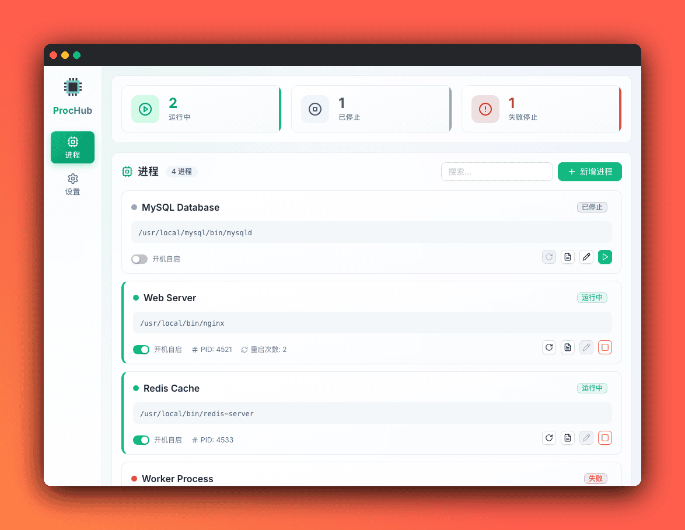
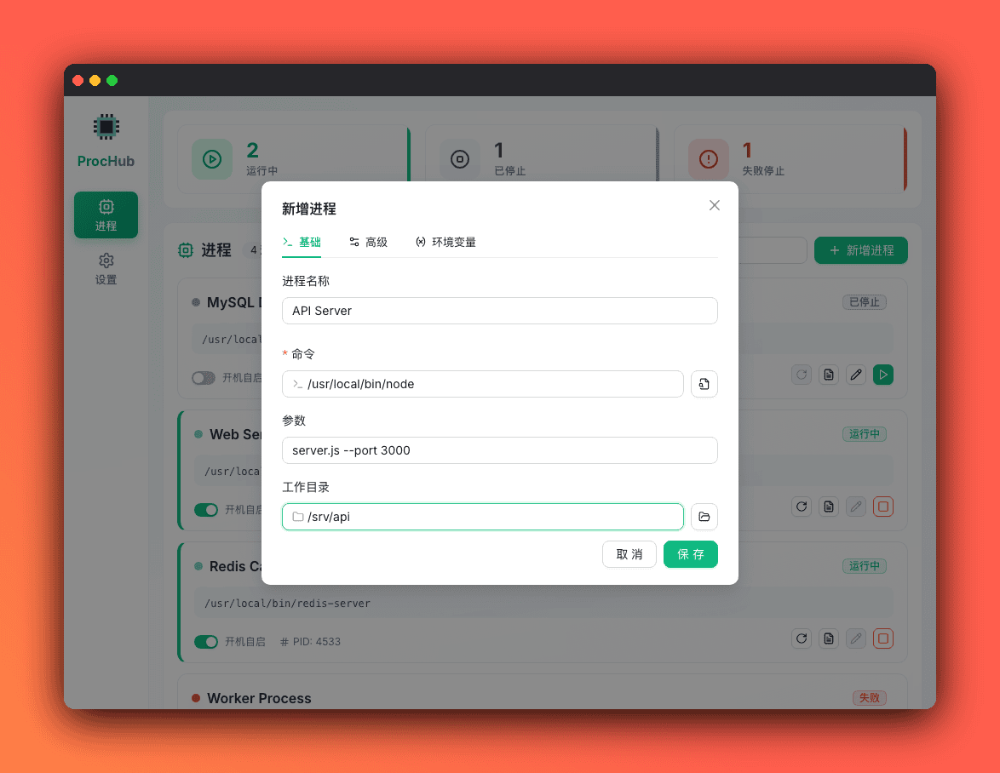
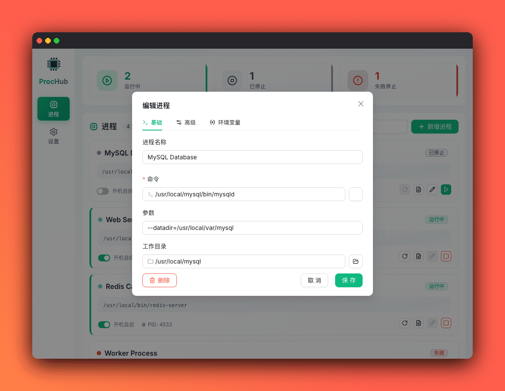
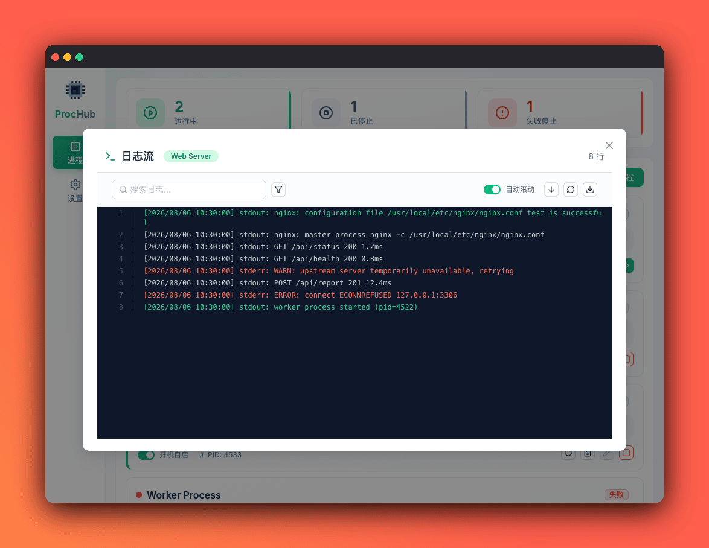
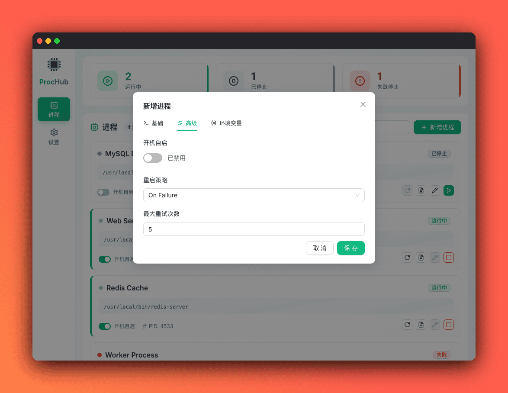
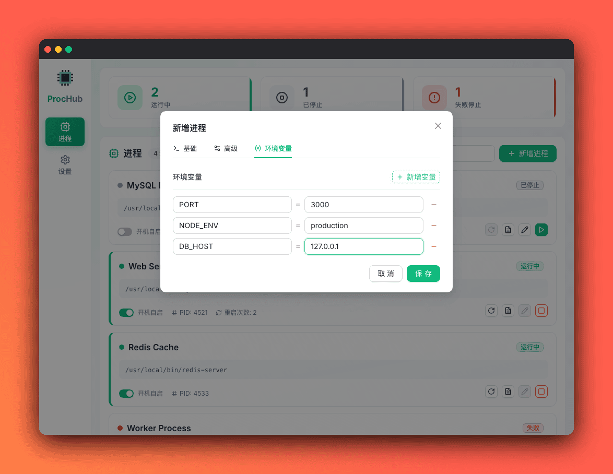
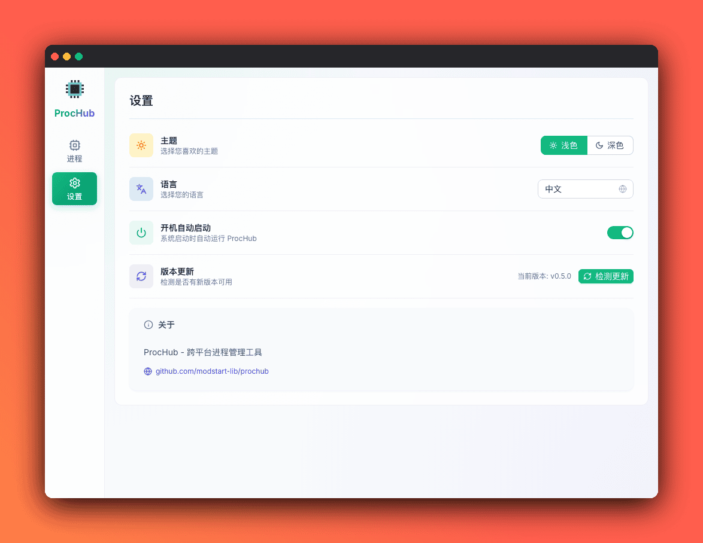

[English](#prochub) | [中文](README.zh-CN.md)

# ProcHub

ProcHub is a cross-platform desktop application for process management, built with Wails, Go, and Vue 3 + TypeScript. It provides an intuitive interface to manage, monitor, and control background processes across Windows, macOS, and Linux.

## Screenshot



### Process Management


Add, remove, start, stop, and restart processes with auto-start and restart policies, plus real-time monitoring of PID, restart count, and errors.

| Add Process | Edit Process | Process Logs |
|:-----------:|:------------:|:------------:|
|  |  |  |

### Advanced Settings & Environment Variables

Configure auto-start, restart policy, max retries, and custom environment variables when adding a process.

| Advanced Settings | Environment Variables |
|:-----------------:|:---------------------:|
|  |  |

### Settings Page

Theme, language, auto-start on boot, version update, and about are managed on the settings page.



## Features

### Process Management
- **Add/Remove Processes**: Easily add new processes with customizable commands, arguments, and environment variables
- **Start/Stop/Restart**: Full control over process lifecycle with graceful shutdown support
- **Auto-start**: Configure processes to start automatically when the application launches
- **Restart Policies**: Support for `always`, `on_failure`, and `never` restart policies
- **Process Monitoring**: Real-time status monitoring with PID, restart count, and error tracking

### Cross-Platform Support
- **Windows** (amd64)
- **macOS** (Intel and Apple Silicon)
- **Linux** (amd64, arm64)

### Auto-start on Boot
- **macOS**: Uses LaunchAgent
- **Linux**: Uses XDG Autostart
- **Windows**: Uses Registry

### Logging
- Rolling log files with configurable retention
- Real-time log streaming
- Separate stdout/stderr capture

## Build

### Prerequisites

- Go 1.23.0 or higher
- Node.js 18+ and npm
- [Wails CLI](https://wails.io/docs/gettingstarted/installation)

### Development

```bash
# Install frontend dependencies
cd frontend && npm install && cd ..

# Install Go dependencies
go mod download

# Run in development mode
wails dev
```

### Production Build

```bash
# Build for current platform
wails build

# The built application will be in build/bin directory
```


## 💬 Join the Community

> Add friend with note "ProcHub"

| WeChat Group | QQ Group |
|:------------:|:--------:|
|  |  |

## License

This project is licensed under the [Apache 2.0 License](LICENSE).

