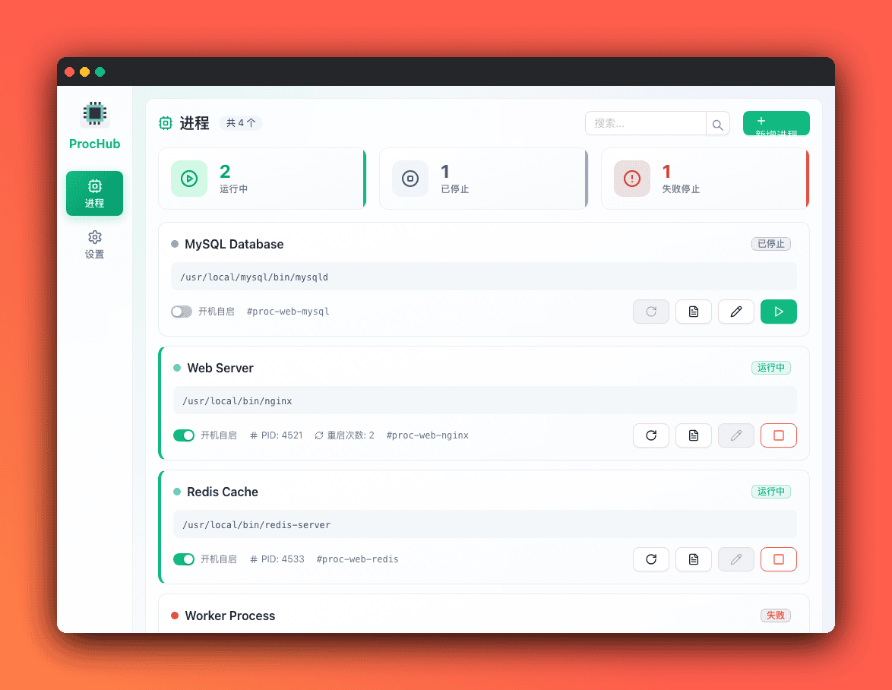
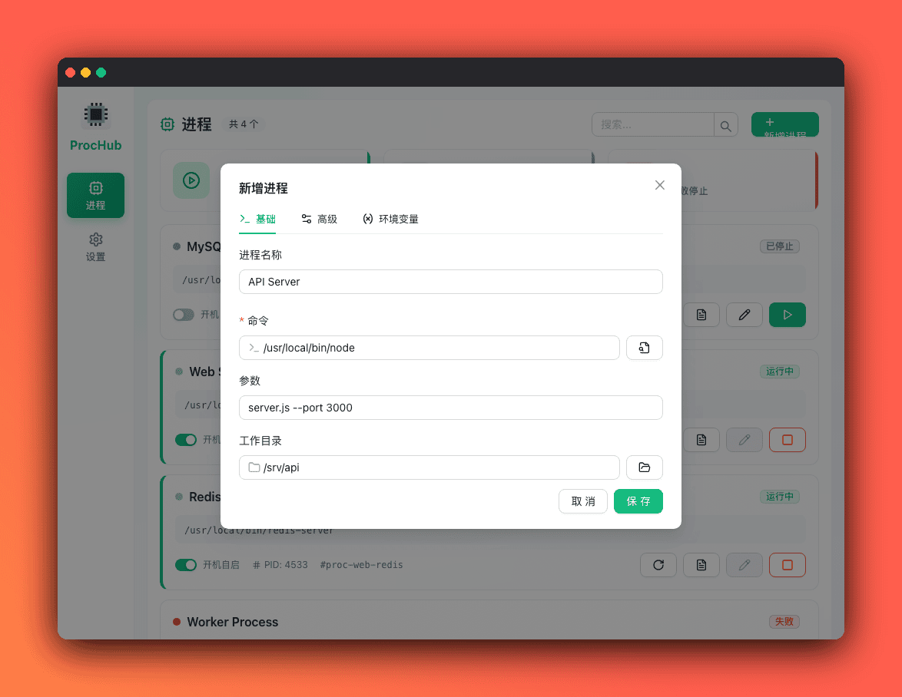
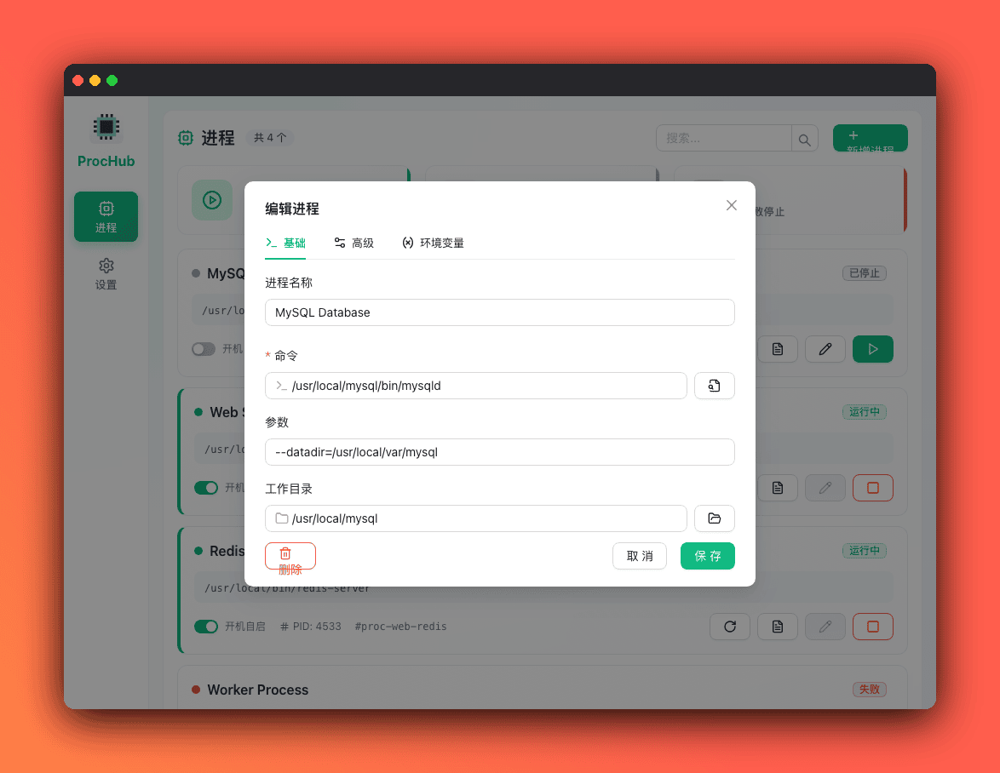
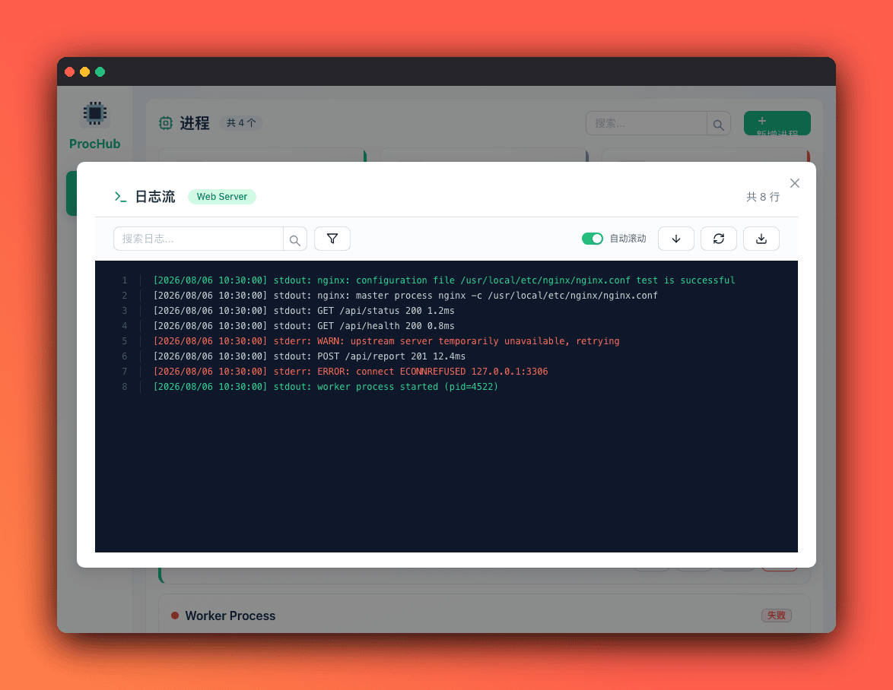
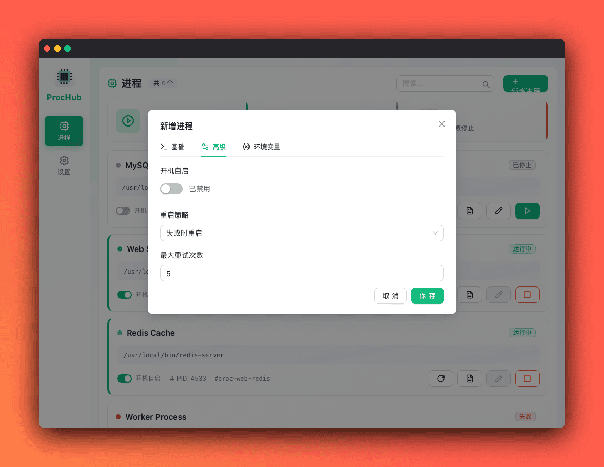
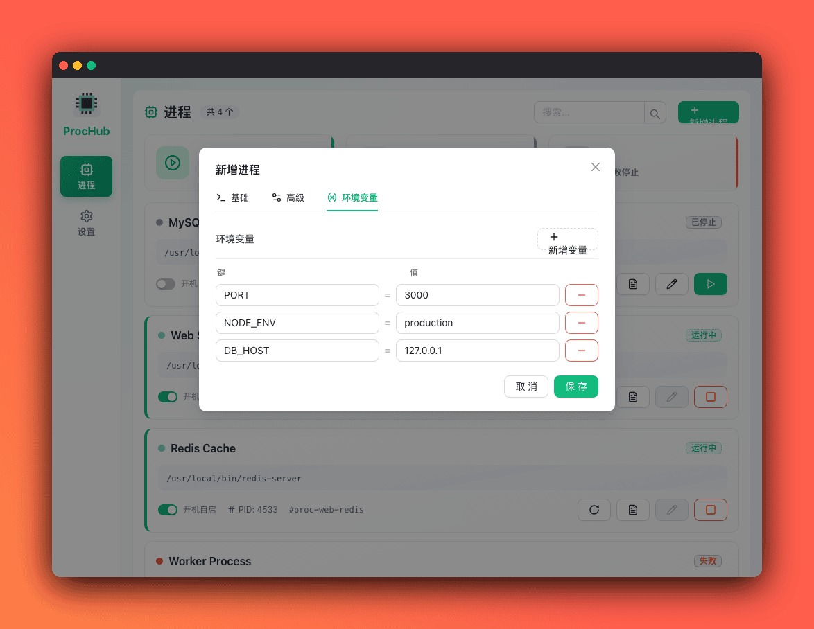
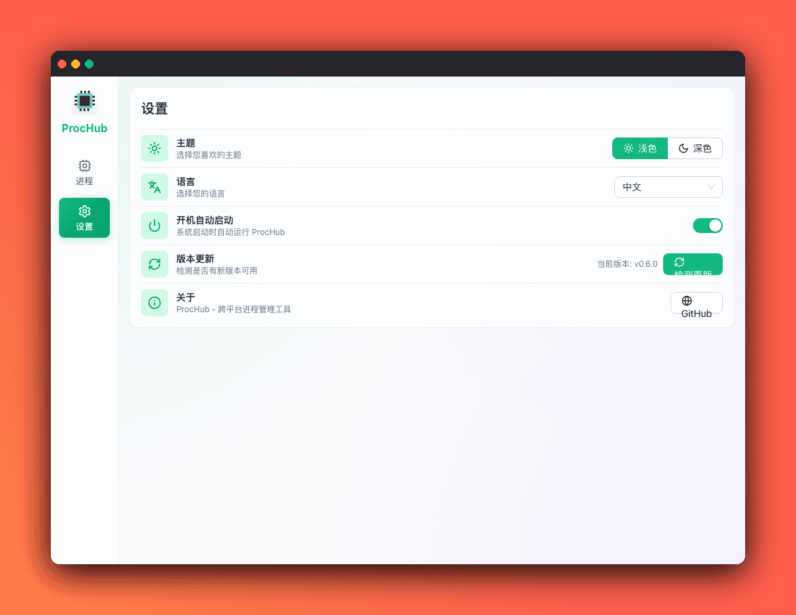

[English](README.md) | [中文](#prochub)

# ProcHub

ProcHub 是一个跨平台的桌面进程管理应用，使用 Wails、Go 和 Vue 3 + TypeScript 构建。它提供直观的界面来管理、监控和控制 Windows、macOS 和 Linux 上的后台进程。

## 截图预览



### 进程管理


支持添加、删除、启动、停止、重启进程，可配置开机自启和重启策略，实时监控 PID、重启次数和错误信息。

| 新增进程 | 编辑进程 | 进程日志 |
|:--------:|:--------:|:--------:|
|  |  |  |

### 新增进程 - 高级设置与环境变量

支持配置开机自启、重启策略、最大重启次数，以及自定义环境变量。

| 高级设置 | 环境变量 |
|:--------:|:--------:|
|  |  |

### 设置页

主题、语言、开机自启、版本更新与关于信息统一在设置页管理。



## 功能特性

### 进程管理
- **添加/删除进程**：轻松添加新进程，支持自定义命令、参数和环境变量
- **启动/停止/重启**：完整的进程生命周期控制，支持优雅关闭
- **自动启动**：配置进程在应用启动时自动运行
- **重启策略**：支持 `always`（始终）、`on_failure`（失败时）和 `never`（从不）重启策略
- **进程监控**：实时状态监控，包括 PID、重启次数和错误追踪

### 跨平台支持
- **Windows** (amd64)
- **macOS** (Intel 和 Apple Silicon)
- **Linux** (amd64, arm64)

### 开机自启
- **macOS**：使用 LaunchAgent
- **Linux**：使用 XDG Autostart
- **Windows**：使用注册表

### 日志功能
- 滚动日志文件，支持可配置的保留策略
- 实时日志流
- 分离的 stdout/stderr 捕获

## 命令行工具

ProcHub 在同一可执行文件中内置了命令行工具：不带子命令启动时照常打开界面，带子命令时执行 CLI，并通过本地控制接口与运行中的应用通信（启动时会把端口与令牌写入数据目录的 `auth.json`）。

```bash
# 创建 prochub 命令，指向已安装的应用（macOS）
make cli

prochub process list                       # 列出全部进程
prochub process start <id>                 # 启动进程
prochub process stop <id>                  # 停止进程
prochub process logs <id> --tail 200       # 查看最后 200 行日志
prochub process logs <id> --follow         # 持续输出新增日志
prochub config get                         # 查看当前配置
prochub config set theme light|dark        # 设置明暗主题
prochub config set language zh|en          # 设置界面语言
prochub config set autostart on|off        # 设置开机自动启动
prochub config set autostart-wsl on|off    # 设置开机时自动启动 WSL
prochub wsl status                         # 查看 WSL 运行状态
prochub wsl start                          # 启动 WSL
prochub wsl stop                           # 停止 WSL
prochub wsl restart                        # 重启 WSL
prochub status                             # 查看运行状态
prochub version                            # 查看版本
```

进程日志文件保存在数据目录（`<dataDir>/<logDir>/<id>`），因此界面打开时也可用 `logs` 读取。

`autostart-wsl` 只控制“开机时是否自动启动 WSL”，与应用自身的开机自启设置相互独立，也不影响 `wsl start`/`wsl stop` 手动启停。

## 构建

### 环境要求

- Go 1.23.0 或更高版本
- Node.js 18+ 和 npm
- [Wails CLI](https://wails.io/docs/gettingstarted/installation)

### 开发模式

```bash
# 安装前端依赖
cd frontend && npm install && cd ..

# 安装 Go 依赖
go mod download

# 运行开发模式
wails dev
```

### 生产构建

```bash
# 为当前平台构建
wails build

# 构建的应用程序将在 build/bin 目录中
```

## 💬 交流沟通

> 添加好友时备注 "ProcHub"

| 微信交流群 | QQ 交流群 |
|:----------:|:---------:|
|  |  |

## 许可证

本项目采用 [Apache 2.0 许可证](LICENSE)。
